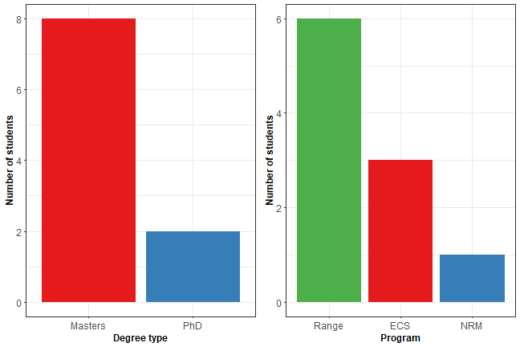
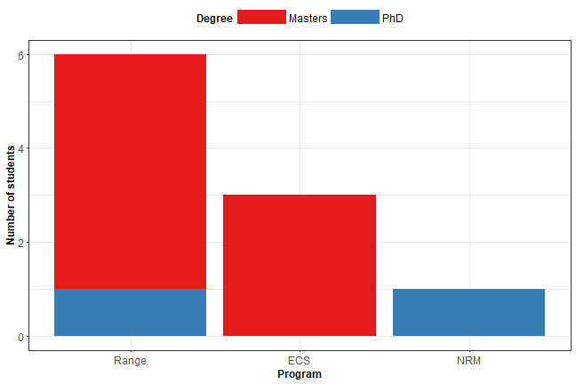
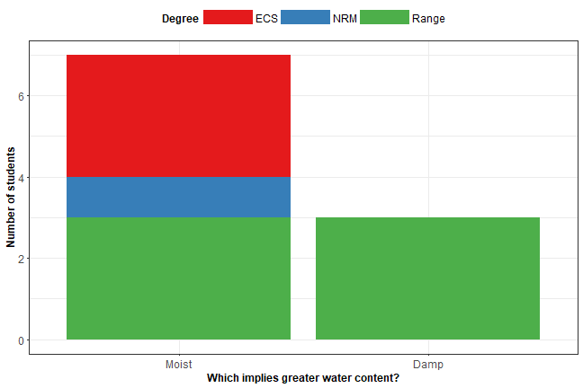
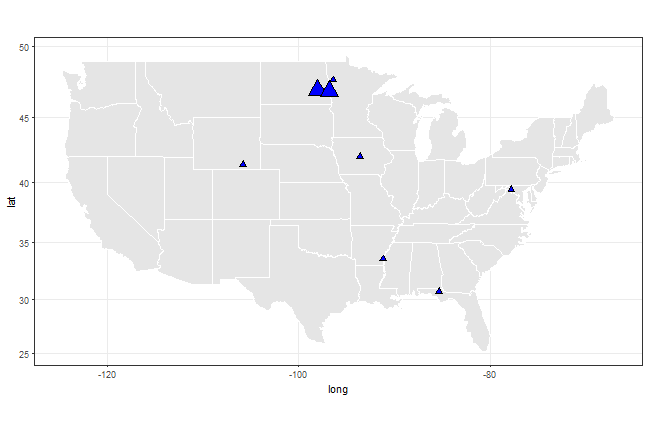
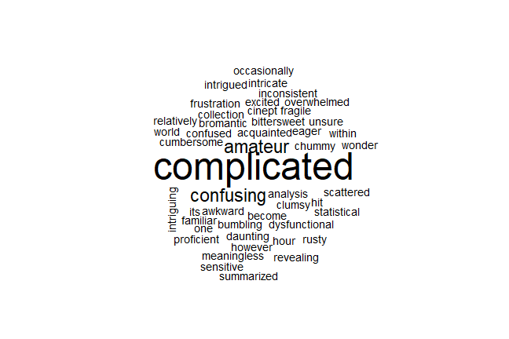

We can look at each of these responses individually:



Or we can combine the factors and show two categorical variables at once:



Classic bar debate:



```
## Error: ggplot2 doesn't know how to deal with data of class list
```

Where you all are from. The bigger the symbol, the more of you are from there:



```
## Error in select_impl(.data, vars): found duplicated column name: NA, NA, NA
```

On your relationship with data: 



