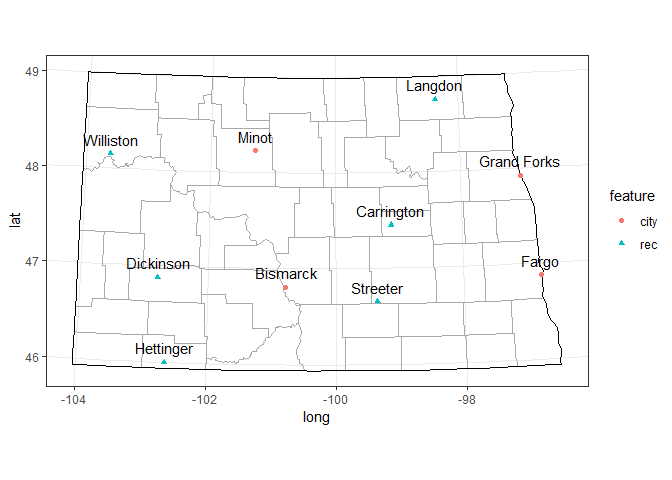

# Introduction 

Since **ggmap**'s *geocode* function stopped accessing Google Map's API like it used to, we turn to other solutions to getting coordinates for place names. Having played with a couple I've landed on the **geonames** package from **ropensci**, which creates a connection between **R** and the open data source geonames. Main benefits include: 

* It is free (although a free account is required to use)
* It has a lot of options for specifying searches 

Compared to *geocode* this last point makes it a little less straightforward to use, but overall I find it better. 

# Get set up 

1. Create a free geonames account at http://www.geonames.org/login/. 

2. Install the package from github using the **devtools** package:


```r
devtools::install_github("ropensci/geonames")
```

3. Set your **R** environment's global options to include your username for geonames:


```r
options(geonamesUsername="USERNAME")
```

4. Load the library

```r
library(geonames)
```

# Using the package

The key function here is *GNsearch*, which searches the geonames database online. Let's start by just searching for "Fargo:"


```r
GNsearch(name_equals = "Fargo")
```

We see in the output below that the database has more places named "Fargo" than we might have anticipated... 19 in fact, including a stream in Djibouti and a farm in Norway. Scroll down below the table and see how we refine the search. 


---------------------------------------------------------------------
 adminCode1      lng       geonameId   toponymName   countryId   fcl 
------------ ------------ ----------- ------------- ----------- -----
     ND        -96.7898     5059163       Fargo       6252001     P  

     AR       -91.18012     4110427       Fargo       6252001     P  

     08       -82.06649     5951547       Fargo       6251999     L  

     IN       -86.48332     4257356       Fargo       6252001     P  

     WI       -90.95735     5252503       Fargo       6252001     P  

     GA       -82.56652     4194396       Fargo       6252001     P  

     OK       -99.62373     4536249       Fargo       6252001     P  

     OH       -82.83129     5153786       Fargo       6252001     P  

     IL       -90.85485     4238206       Fargo       6252001     P  

     NY       -75.58214     5116918       Fargo       6252001     P  

     MI       -82.65909     4992503       Fargo       6252001     P  

     05        18.7693      2432698       Fargo       2434508     P  

     TX       -99.27758     4690171       Fargo       6252001     P  

     IN       -87.27946     4920194       Fargo       6252001     P  

     NY       -78.43641     4833118       Fargo       6252001     P  

     19        -7.85516     2277430     Ziah Town     2275384     P  

     OR       -122.81593    5726237       Fargo       6252001     S  

     00        42.11083     223591        Fargo       223816      H  

     09        13.84315     9460892       Fargo       3144096     S  
---------------------------------------------------------------------

Table: All the places returned by searching geonames for 'Fargo'. (continued below)

 
-------------------------------------------------------------
 population   countryCode     name            fclName        
------------ ------------- ----------- ----------------------
   118523         US          Fargo      city, village,...   

     90           US          Fargo      city, village,...   

     0            CA          Fargo       parks,area, ...    

     0            US          Fargo      city, village,...   

     0            US          Fargo      city, village,...   

    325           US          Fargo      city, village,...   

    375           US          Fargo      city, village,...   

     0            US          Fargo      city, village,...   

     0            US          Fargo      city, village,...   

     0            US          Fargo      city, village,...   

     0            US          Fargo      city, village,...   

     0            TD          Fargo      city, village,...   

     0            US          Fargo      city, village,...   

     0            US          Fargo      city, village,...   

     0            US          Fargo      city, village,...   

     0            LR        Ziah Town    city, village,...   

     0            US          Fargo     spot, building, farm 

     0            DJ          Fargo      stream, lake, ...   

     0            NO          Fargo     spot, building, farm 
-------------------------------------------------------------

Table: Table continues below

 
--------------------------------------------------------------------------------
 adminCodes1.ISO3166_2    countryName           fcodeName           adminName1  
----------------------- --------------- ------------------------- --------------
          ND             United States   seat of a second-order    North Dakota 
                                         administrative division                

          AR             United States       populated place         Arkansas   

          ON                Canada                area               Ontario    

          IN             United States       populated place         Indiana    

          WI             United States       populated place        Wisconsin   

          GA             United States       populated place         Georgia    

          OK             United States       populated place         Oklahoma   

          OH             United States       populated place           Ohio     

          IL             United States       populated place         Illinois   

          NY             United States       populated place         New York   

          MI             United States       populated place         Michigan   

          GR                 Chad            populated place          Guéra    

          TX             United States       populated place          Texas     

          IN             United States       populated place         Indiana    

          NY             United States       populated place         New York   

          GG                Liberia          populated place       Grand Gedeh  

          OR             United States                                Oregon    

          NA               Djibouti              stream                         

          18                Norway                farm               Nordland   
--------------------------------------------------------------------------------

Table: Table continues below

 
------------------
   lat      fcode 
---------- -------
 46.87719   PPLA2 

 34.95148    PPL  

 42.35009   AREA  

 38.40006    PPL  

 43.45581    PPL  

 30.68188    PPL  

 36.37615    PPL  

 40.35812    PPL  

 39.97366    PPL  

 44.03396    PPL  

 43.10308    PPL  

 11.8908     PPL  

 34.29481    PPL  

 40.51893    PPL  

 42.92645    PPL  

 5.76641     PPL  

 45.24818    NA   

 11.67222    STM  

 66.15456    FRM  
------------------

## Refining *GNsearch* results

You should notice immediately that along with latitude and longitude, the results include a lot of information about the various places under some unclear column names. We can use this information to narrow our search results. An overview of each of the parameters -- column names -- [is available here](http://www.geonames.org/export/geonames-search.html). 

Not always do column/parameter names match up with arguments to the *GNsearch* function. For example, *featureClass* is the argument that maps to the *fcl* parameter. For many uses this is probably the finest search parameter one might use: P = populated place, L = parks, etc. Much much finer designations can be given with the *fcode* or *fcodeName* parameter ([see here](http://www.geonames.org/export/codes.html) ). For example, Fargo, ND and Fargo, AR are both P for populated places, but only Fargo, ND is fcode PPLA2, for "seat of a second-order administrative division", or county seat. (States are first-order administrative divisions).

Because we know we want the Fargo in the state of North Dakota, we specify adminCode1="ND" and only one result is returned: 


```r
GNsearch(name_equals = "Fargo", adminCode1="ND")
```


--------------------------------------------------------------------------------
 adminCode1     lng      geonameId   toponymName   countryId   fcl   population 
------------ ---------- ----------- ------------- ----------- ----- ------------
     ND       -96.7898    5059163       Fargo       6252001     P      118523   
--------------------------------------------------------------------------------

Table: All the places returned by searching geonames for 'Fargo' in the state of North Dakota. (continued below)

 
-----------------------------------------------------------------
 countryCode   name         fclName        adminCodes1.ISO3166_2 
------------- ------- ------------------- -----------------------
     US        Fargo   city, village,...            ND           
-----------------------------------------------------------------

Table: Table continues below

 
---------------------------------------------------------------------------
  countryName           fcodeName           adminName1      lat      fcode 
--------------- ------------------------- -------------- ---------- -------
 United States   seat of a second-order    North Dakota   46.87719   PPLA2 
                 administrative division                                   
---------------------------------------------------------------------------

## Cut to the chase

Here's the script used to generate the list of towns and RECs we used in class [nd.features.d](https://drive.google.com/open?id=1BwVWWHictwrYEPg5MVssG0igVyVMJnkh): 

```r
nd.features <- data.frame(feature=c("city", "city", "city", "city", 
                                    "rec", "rec", "rec", "rec", 
                                    "rec", "rec"), 
                          name=c("Fargo", "Grand Forks", "Bismarck", "Minot", 
                                 "Hettinger", "Williston", "Carrington","Dickinson",
                                 "Streeter", "Langdon") )
nd.features.d <- 
  nd.features %>%
    split(.$name) %>%
      map( ~ GNsearch(name_equals = .x$name, country = "US", 
                      adminCode1="ND", featureClass="P")) %>%
        map_dfr(~ (.))  %>%
    full_join(nd.features) %>%
    mutate(state = adminName1, 
           long=as.numeric(lng), 
           lat = as.numeric(lat)) %>%
    select(feature, name, state, long, lat) 
```


-------------------------------------------------------
 feature      name          state        long     lat  
--------- ------------- -------------- -------- -------
  city      Bismarck     North Dakota   -100.8   46.81 

   rec     Carrington    North Dakota   -99.13   47.45 

   rec      Dickinson    North Dakota   -102.8   46.88 

  city        Fargo      North Dakota   -96.79   46.88 

  city     Grand Forks   North Dakota   -97.03   47.93 

   rec      Hettinger    North Dakota   -102.6    46   

   rec       Langdon     North Dakota   -98.37   48.76 

  city        Minot      North Dakota   -101.3   48.23 

   rec      Streeter     North Dakota   -99.35   46.66 

   rec      Williston    North Dakota   -103.6   48.15 
-------------------------------------------------------

Table: Longitude and latitude of cities and RECs in North Dakota


```r
NDs <- map_data("state") %>%
  filter(region == "north dakota")

NDc <- map_data("county") %>%
  filter(region == "north dakota")

ggplot() + theme_bw() + 
  geom_path(data=NDc, 
            aes(x=long, y=lat, group=group), 
            color="dark grey") +
  geom_path(data=NDs, 
            aes(x=long, y=lat, group=group), 
            color="black") +
  geom_point(data=nd.features.d, 
             aes(x=long, y=lat, 
                shape=feature, color=feature)) +
  geom_text(data=nd.features.d, 
            aes(x=long, y=lat, 
                label=name), nudge_y = 0.15) +
  coord_map("conic", 60) 
```



